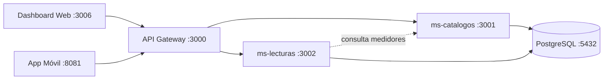

# SEMAPA BigData Demo

Plataforma de gestión inteligente del consumo de agua para **SEMAPA Cochabamba**, con arquitectura **N-Capas + Microservicios** y frontend web/móvil.

## Stack

| Componente | Tecnología | Puerto |
|---|---|---|
| API Gateway | NestJS | 3000 |
| ms-catalogos | NestJS + PostgreSQL | 3001 |
| ms-lecturas | NestJS + PostgreSQL | 3002 |
| PostgreSQL | Docker | 5432 |
| **Dashboard Web** | Next.js + TypeScript + Tailwind + Recharts | **3006** |
| **App Móvil** | React Native / Expo | **8081** |

## Estructura del proyecto

```
semapa-bigdata/
├── docker-compose.yml
├── README.md
├── .env.example
├── api-gateway/          # Puerto 3000
├── ms-catalogos/         # Puerto 3001
├── ms-lecturas/          # Puerto 3002
├── dashboard-web/        # Puerto 3006 — Fase 2
├── mobile-app/           # Puerto 8081 — Fase 2
└── libs/                 # Librerías compartidas (futuras fases)
```

## Arquitectura



## Inicio rápido (backend + dashboard)

### 1. Levantar servicios con Docker

```bash
cd semapa-bigdata
docker compose up -d --build
```

> Si el puerto **5432** ya está ocupado:
>
> ```bash
> POSTGRES_HOST_PORT=5433 docker compose up -d --build
> ```

### 2. Cargar datos iniciales (seeds)

```bash
docker compose exec ms-catalogos npm run seed
docker compose exec ms-lecturas npm run seed
```

### 3. Acceder a los servicios

| Servicio | URL |
|---|---|
| API Gateway (Swagger) | http://localhost:3000/docs |
| Dashboard Web | http://localhost:3006 |
| ms-catalogos | http://localhost:3001/docs |
| ms-lecturas | http://localhost:3002/docs |

---

## Dashboard Web (Fase 2)

### Instalación

```bash
cd dashboard-web
cp .env.example .env.local
npm install
```

### Desarrollo local

```bash
npm run dev
# Abre http://localhost:3006
```

### Credenciales mock (login)

| Campo | Valor |
|---|---|
| Usuario | `admin` (cualquier valor válido) |
| Contraseña | `semapa123` (cualquier valor válido) |

El login guarda un token mock en `localStorage` y redirige a `/dashboard`. No hay autenticación real en esta fase.

### Pantallas

| Ruta | Descripción |
|---|---|
| `/login` | Inicio de sesión mock |
| `/dashboard` | KPIs y gráficos ejecutivos (Recharts) |
| `/dashboard/contratos` | Tabla con búsqueda y filtros |
| `/dashboard/medidores` | Inventario IoT con badges de estado |
| `/dashboard/lecturas` | Lecturas + botón "Simular lecturas" |
| `/dashboard/preavisos` | Preavisos + descarga PDF |
| `/dashboard/reportes` | Reportes demo |
| `/dashboard/configuracion` | Configuración del sistema |

### Generación de PDF (pdfmake)

En **Preavisos**, cada fila tiene:

- **Descargar PDF** — formato media carta (`generatePreavisoPdf`)
- **PDF térmico** — rollo 55mm (`generateThermalPreavisoPdf`)

Utilidad: `dashboard-web/src/lib/pdf/preaviso-pdf.ts`

El PDF incluye: logo SEMAPA, datos del titular, contrato, medidor, período, consumo, monto, detalle tarifario, historial 6 meses y código de validación.

### Consumo del backend

El cliente API está en `dashboard-web/src/lib/api/`:

```
NEXT_PUBLIC_API_URL=http://localhost:3000
```

| Servicio | Endpoint gateway |
|---|---|
| Contratos | `GET /catalogos/contratos` |
| Medidores | `GET /catalogos/medidores` |
| Lecturas | `GET /lecturas` |
| Simular | `POST /lecturas/simular` |

Si un endpoint falla, el dashboard usa **datos mock** automáticamente para que la demo no se rompa.

---

## App Móvil (Fase 2)

App para **registro manual de lecturas en campo**.

### Instalación

```bash
cd mobile-app
cp .env.example .env
npm install
```

### Ejecutar con Expo

```bash
npm start
# Puerto 8081 — escanear QR con Expo Go
```

También:

```bash
npm run android   # Emulador Android
npm run ios       # Simulador iOS (macOS)
```

### Credenciales mock

| Campo | Valor |
|---|---|
| Usuario | `lector` |
| Contraseña | `semapa123` |

### Pantallas

- **Login** — token mock en AsyncStorage
- **Home** — KPIs del lector
- **Medidores** — lista pendiente → registro de lectura
- **Historial** — lecturas registradas
- **Perfil** — datos mock del lector

### Registro de lectura

Envía al backend:

```bash
POST http://localhost:3000/lecturas
```

```json
{
  "medidorIot": "IOT-00001",
  "lecturaAnterior": 150,
  "lecturaActual": 158,
  "fechaHoraLectura": "2026-06-05T12:00:00.000Z",
  "radiobase": "MANUAL",
  "estado": "NORMAL"
}
```

> En dispositivo físico, cambiar `EXPO_PUBLIC_API_URL` a la IP de tu máquina (ej. `http://192.168.1.10:3000`).

### Docker (opcional, solo desarrollo)

```bash
docker compose --profile mobile-dev up mobile-app
```

---

## Variables de entorno

### Raíz (`.env.example`)

```
POSTGRES_DB=semapa_demo_db
POSTGRES_USER=semapa
POSTGRES_PASSWORD=semapa123
APP_PORT=3000
MS_CATALOGOS_URL=http://ms-catalogos:3001
MS_LECTURAS_URL=http://ms-lecturas:3002
```

### Dashboard (`dashboard-web/.env.example`)

```
NEXT_PUBLIC_API_URL=http://localhost:3000
```

### App móvil (`mobile-app/.env.example`)

```
EXPO_PUBLIC_API_URL=http://localhost:3000
```

---

## Endpoints del API Gateway

| Método | Ruta | Descripción |
|---|---|---|
| GET | `/health` | Estado del gateway y microservicios |
| GET | `/catalogos/contratos` | Lista de contratos |
| GET | `/catalogos/medidores` | Lista de medidores |
| GET | `/lecturas` | Lista de lecturas |
| POST | `/lecturas` | Crear lectura |
| POST | `/lecturas/simular` | Generar lecturas simuladas |

### Ejemplos con curl

```bash
# Health check
curl http://localhost:3000/health

# Simular lecturas
curl -X POST http://localhost:3000/lecturas/simular \
  -H "Content-Type: application/json" \
  -d '{"cantidad": 5}'

# Crear lectura manual
curl -X POST http://localhost:3000/lecturas \
  -H "Content-Type: application/json" \
  -d '{
    "medidorIot": "IOT-00001",
    "lecturaAnterior": 150,
    "lecturaActual": 158,
    "radiobase": "MANUAL",
    "estado": "NORMAL"
  }'
```

---

## Reglas de negocio (lecturas)

- `consumoM3 = lecturaActual - lecturaAnterior`
- Si `lecturaActual < lecturaAnterior` → estado `ERROR`
- Si ya existe lectura del mismo `medidorIot` y `fechaHoraLectura` → estado `DUPLICADA`

## Comandos útiles

```bash
# Ver logs
docker compose logs -f

# Solo backend
docker compose up -d postgres ms-catalogos ms-lecturas api-gateway

# Detener todo
docker compose down

# Detener y eliminar volúmenes
docker compose down -v
```

## Próximas fases (planificado)

- Autenticación real (JWT/OAuth)
- RabbitMQ para eventos en tiempo real
- Notificaciones reales (email/SMS/push)
- Endpoints de agregación para dashboard
- Librerías compartidas en `libs/`

## Licencia

Demo académica — SEMAPA Cochabamba.
